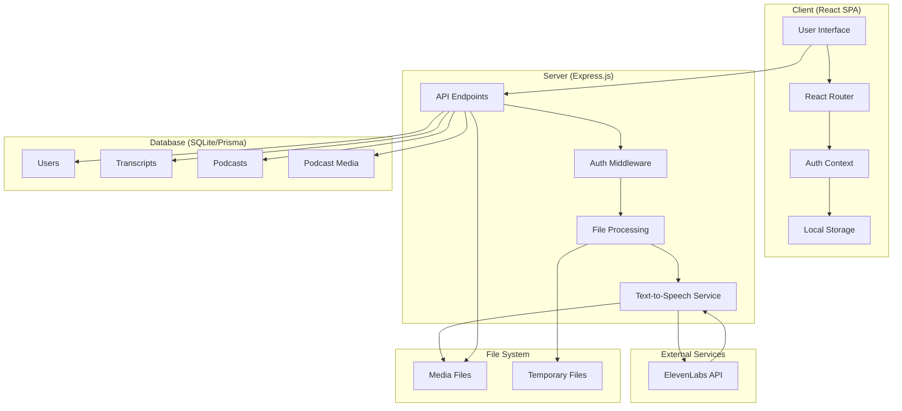
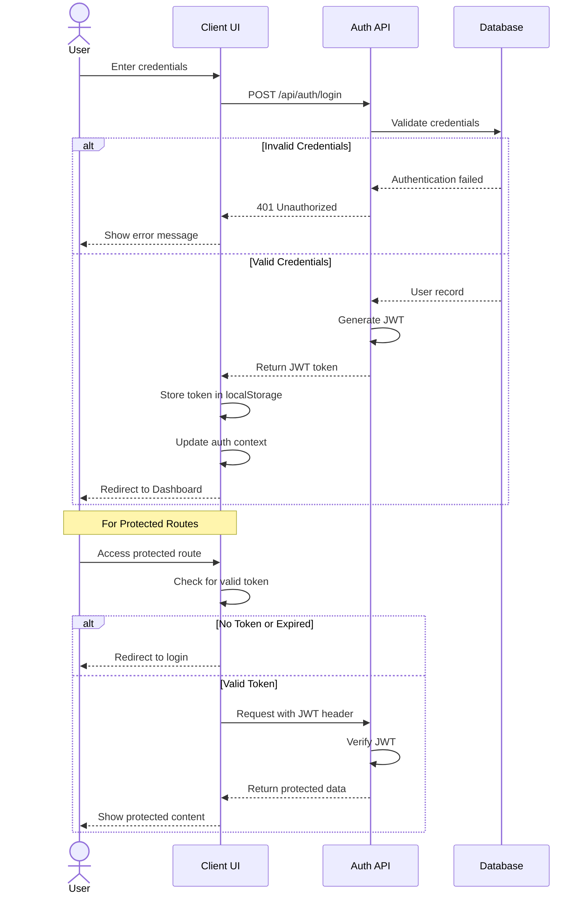
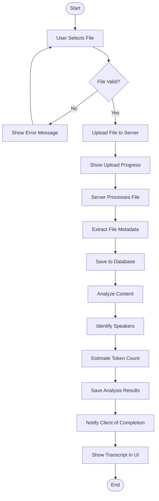
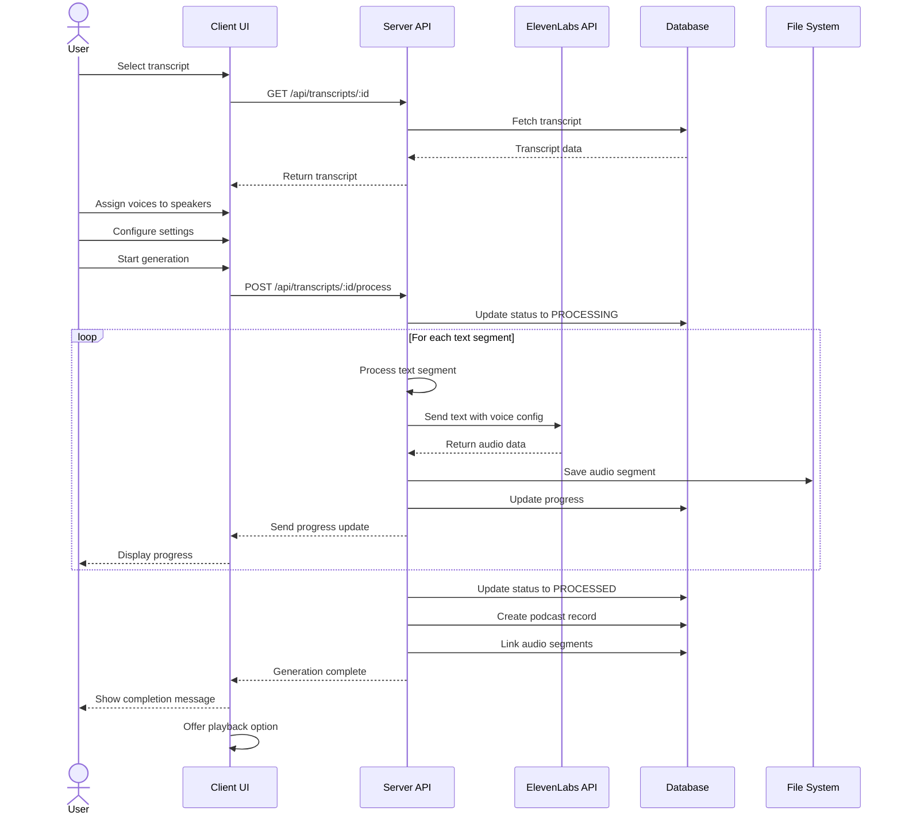
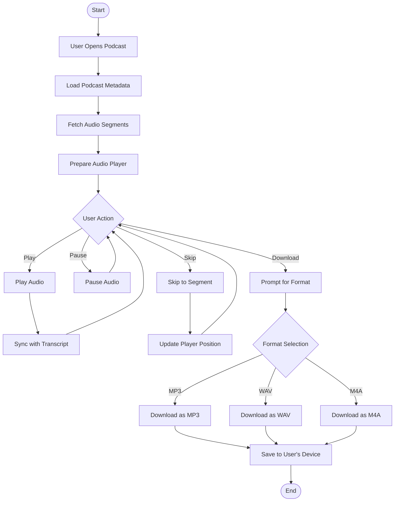
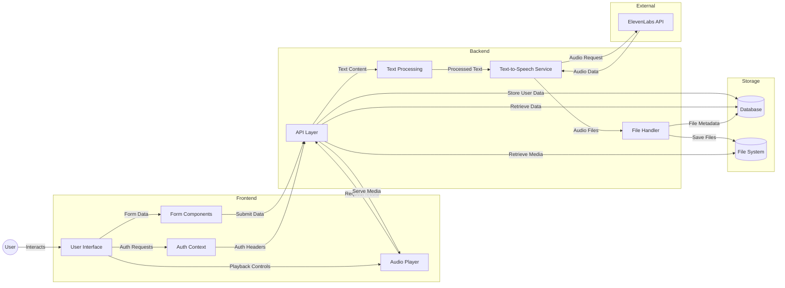
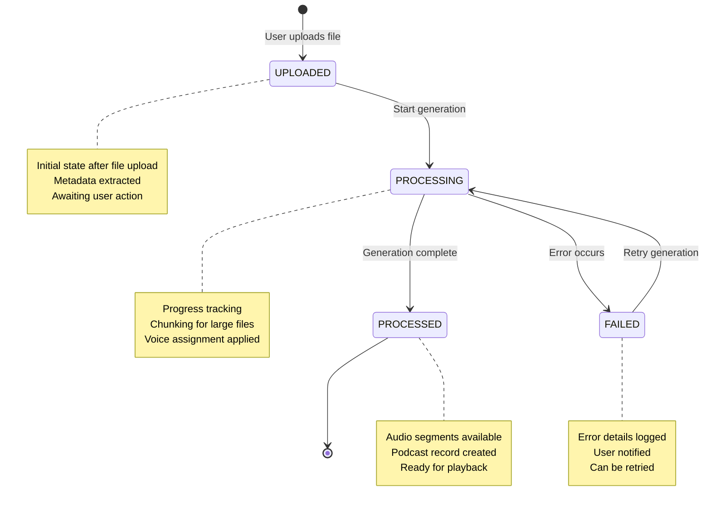
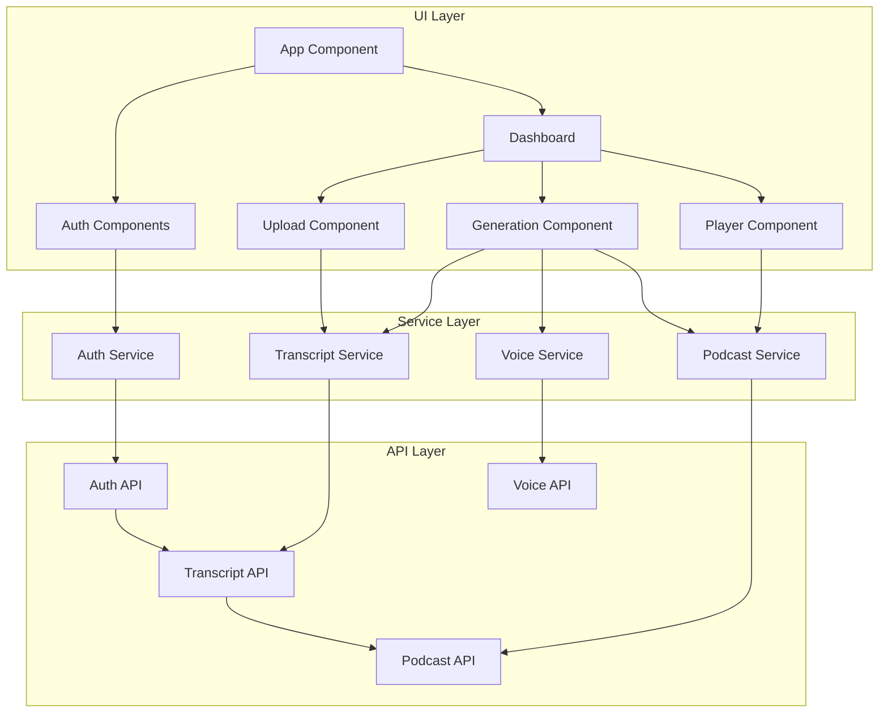

# VeilCast - System Flowcharts

This document contains flowchart diagrams illustrating the key processes and workflows in the VeilCast application.

## Table of Contents
1. [Overall System Architecture](#overall-system-architecture)
2. [User Authentication Flow](#user-authentication-flow)
3. [Transcript Upload and Processing Flow](#transcript-upload-and-processing-flow)
4. [Podcast Generation Flow](#podcast-generation-flow)
5. [Audio Playback and Download Flow](#audio-playback-and-download-flow)

## Overall System Architecture

## User Authentication Flow

## Transcript Upload and Processing Flow

## Podcast Generation Flow

## Audio Playback and Download Flow

## Data Flow Diagram

## State Transition Diagram - Transcript Processing

## Component Interaction Diagram

These diagrams visually represent the main flows and processes in the VeilCast application. They can be rendered in any Markdown viewer that supports Mermaid diagrams, or you can use an online Mermaid renderer to convert them to images if needed. 